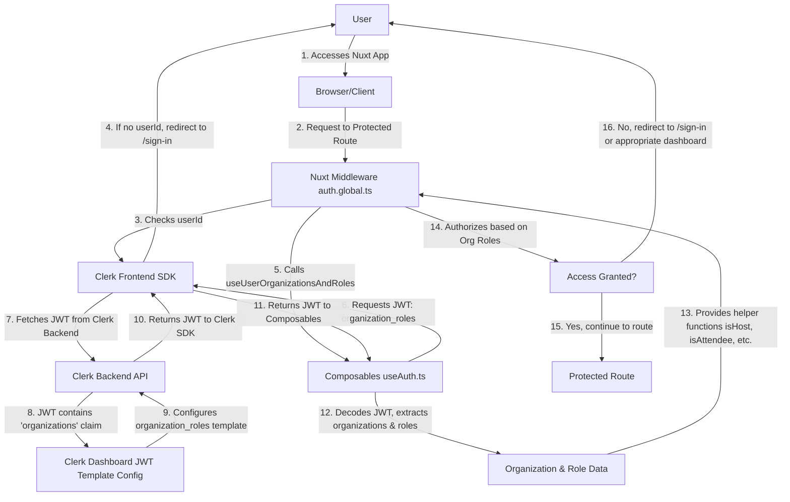

# Clerk Nuxt Example Application

This is a starter template for a Nuxt 3 application integrated with Clerk for authentication and authorization.

## Features

- **Clerk Authentication:** Secure user authentication powered by Clerk, supporting:
  - Email Magic Link sign-in.
  - Email and Password sign-in with verification code (OTP).
- **Role-Based Access Control (RBAC):** Global middleware to protect routes and redirect users based on their assigned roles (admin, host, attendee, both).
- **Nuxt 3:** Built with the latest version of Nuxt.js for a powerful and flexible development experience.
- **Tailwind CSS:** Styled with Tailwind CSS for rapid UI development and easy customization.
- **Segmented Sign-in UI:** A user-friendly interface on the sign-in page to switch between different authentication methods.

## Project Structure

Key files and directories:

- `middleware/auth.global.ts`: Global Nuxt middleware handling authentication checks and role-based redirections.
- `pages/sign-in/index.vue`: The main sign-in page, offering both magic link and email/password options.
- `pages/verify-email.vue`: Handles email verification links from Clerk.
- `components/EmailSignIn.vue`: Component for email magic link authentication.
- `components/EmailPasswordSignIn.vue`: Component for email and password authentication with OTP.
- `components/ui/Button.vue`: A reusable button component styled with Tailwind CSS and `class-variance-authority`.

## Clerk Organizations Implementation

This application utilizes Clerk's Organizations feature to manage complex user roles and permissions. The core idea is to associate users with different types of organizations, each granting specific access levels.

### Organization Types and Roles

- **Host Organizations**: Users within these organizations are involved in hosting events. They can have roles like `admin` (full control over the host organization and its events) or `member` (participate in hosting activities).
- **Attendee Organizations**: Users within these organizations are primarily event attendees. They can have roles like `admin` (manage the attendee organization) or `member` (standard attendee).

### Handling Dual Roles (Host and Attendee)

A key aspect of this implementation is supporting users who are simultaneously part of a Host Organization and an Attendee Organization. The system is designed to allow a single user account to hold both sets of permissions, enabling them to seamlessly switch contexts or have their aggregated permissions applied where necessary (e.g., accessing a `/combined-dashboard`).

### Technical Implementation Details

- **Custom JWT Template (`organization_roles`)**: Clerk is configured to issue a custom JWT template named `organization_roles`. This template is crucial as it embeds the user's organization memberships, their roles within those organizations, and the organization types (host/attendee).
  - **Manual Setup Required**: You **must** configure this `organization_roles` JWT template in your Clerk Dashboard. It should include claims that provide the user's organization memberships and their roles and types. An example structure for the `organizations` claim in the JWT is provided in the `docs/clerk-organizations-requirements.md` file.
- **`composables/useAuth.ts` (`useUserOrganizationsAndRoles`)**: This composable fetches and decodes the `organization_roles` JWT. It then provides helper functions (e.g., `isHostAdmin`, `isAttendee`, `isBothHostAndAttendee`) to easily check a user's organizational affiliations and roles.
- **`middleware/auth.global.ts`**: The global authentication middleware uses the `useUserOrganizationsAndRoles` composable to dynamically determine a user's access rights to various routes based on their organization roles. It handles redirections to role-specific dashboards or sign-in pages accordingly.

### Authentication and Authorization Flow Diagram



## Authentication Flow

1.  **Unauthenticated Users:** If an unauthenticated user tries to access a protected route, they are redirected to the `/sign-in` page.
2.  **Authenticated Users on Public Routes:** If an authenticated user lands on a public route (e.g., `/`, `/sign-in`), they are redirected to a role-specific dashboard (e.g., `/admin`, `/host`, `/attendee`, `/combined-dashboard`) or the home page (`/`) if no specific role is defined.
3.  **Authenticated Users on Protected Routes:** Access to protected routes (e.g., `/admin`, `/host`, `/dashboard`) is granted only if the user's role matches the required access level. Otherwise, they are redirected to `/sign-in`.

## Role-Based Access Control (RBAC) with Clerk Organizations

This application now leverages Clerk's [Organizations](https://clerk.com/docs/organizations/overview) feature for robust role-based access control. Instead of simple session claims, user permissions are determined by their memberships and roles within specific organizations.

The system supports:

- **Host Organizations:** For users managing events.
- **Attendee Organizations:** For users attending events.

Users can have `admin` or `member` roles within these organizations. The application handles complex scenarios, such as a user being both a host and an attendee.

Access to routes like `/admin`, `/host`, `/attendee`, and `/combined-dashboard` is now dynamically managed based on these organization roles.

## Getting Started

### Prerequisites

- Node.js (v18 or higher)
- npm or Yarn
- Clerk Account: Obtain your `NUXT_PUBLIC_CLERK_PUBLISHABLE_KEY` and `NUXT_CLERK_SECRET_KEY` from your Clerk Dashboard.
- **Clerk JWT Template Configuration**: Configure a custom JWT template named `organization_roles` in your Clerk Dashboard. This template must include claims for user organization memberships, their roles, and organization types (host/attendee). Refer to `docs/clerk-organizations-requirements.md` for an example claim structure.

### Installation

1.  Clone the repository:
    ```bash
    git clone <repository-url>
    cd clerk-nuxt-example
    ```
2.  Install dependencies:
    ```bash
    npm install
    # or
    yarn install
    ```
3.  Create a `.env` file in the project root and add your Clerk keys:
    ```
    NUXT_PUBLIC_CLERK_PUBLISHABLE_KEY="pk_live_YOUR_PUBLISHABLE_KEY"
    NUXT_CLERK_SECRET_KEY="sk_live_YOUR_SECRET_KEY"
    ```
4.  **Configure Clerk JWT Template**: As mentioned in the Prerequisites, configure the `organization_roles` JWT template in your Clerk Dashboard. This is a crucial step for role-based access control to function correctly.

### Development Server

Start the development server:

```bash
npm run dev
# or
yarn dev
```

Open your browser to `http://localhost:3000`.

### Build for Production

```bash
npm run build
# or
yarn build
```

### Preview Production Build

```bash
npm run preview
# or
yarn preview
```

## Customization

- **Styling:** Modify `tailwind.config.js` and `assets/css/main.css` for global styles. Component-specific styles are handled via Tailwind classes directly in the Vue components.
- **Roles:** Adjust the `publicRoutes` array and role-based logic in `middleware/auth.global.ts` to fit your application's needs.
- **Clerk Configuration:** Refer to the [Clerk Nuxt documentation](https://clerk.com/docs/references/nuxt/overview) for advanced configuration options.

## Contributing

Feel free to contribute to this starter template by opening issues or pull requests.
